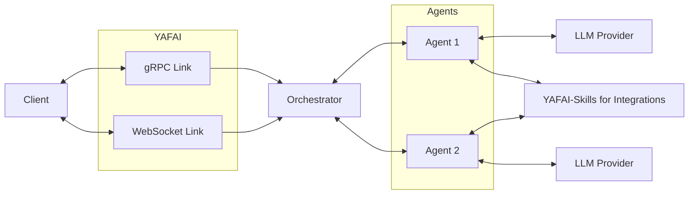

## What is YAFAI ?
> YAFAI - Yet Another Framework for Agentic Interfaces
- YAFAI is a modular framework designed to simplify the creation and deployment of multi-agent systems.
- Instead of writing custom orchestration logic for each scenario, YAFAI allows you to define agents, their behaviours and their integrations through declarative configurations.
- It's static core ensures consistency and reusability across environments, making it ideal for research, prototyping, or production scenarios involving intelligent agents.

  

    
    
  

## Why YAFAI? 
YAFAI has been built keeping the below design aspects in mind.
  - **Configuration Driven :** Define multi-agent systems declaratively.
  - **Compiled Core :** A stable, reusable runtime that adapts to changing configurations.
  - **Portability :** Move agent systems seamlessly between local, cloud or edge.
  - **Versioning :** Track,Manage system changes via version-controlled configurations.
  - **Rapid Prototyping :** Iterate quickly on agent setups by simply editing configuration files.
  - **Light Weight :**  Core Engine is a light weight golang binary, released for all major platforms.

## Architecture

YAFAI as a project is built around two modules, 

  - **YAFAI-Core** : The core engine that manages agent orchestration and memory
  - **YAFAI-Skills**: The tools and integration server for YAFAI Agents

---

<CardGroup cols={2}>
  <Card
    title="YAFAI-Core"
    icon="bot-message-square"
    href="https://mintlify.com/docs/quickstart"
  >
    Learn more about yafai-core
  </Card>
  <Card
    title="YAFAI-Skills"
    icon="server-cog"
    href="https://mintlify.com/docs/development"
  >
    Learn More about yafai-skills
  </Card>
</CardGroup>
